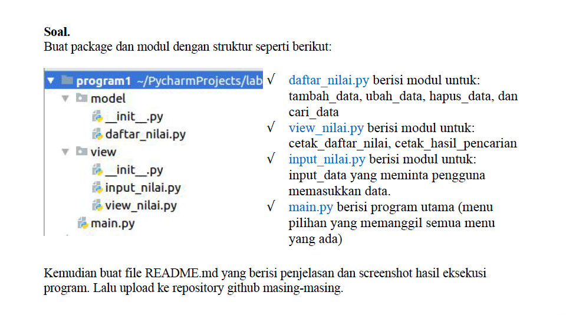

## Nama: Faris Syahluthfi
## Kelas: TI.20.A.2
## NIM: 3120100034

## UAS PEMROGRAMAN   

Disini saya akan menjelaskan tugas UAS. Adapun soal yang diberikan oleh dosen ada digambar bawah ini:
  

Oke kita mulai saja. Pertama kita buat file packagenya dulu. disini saya membuat file packagenya di aplikasi Pycharm.
  