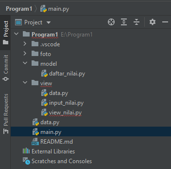

## Nama: Faris Syahluthfi
## Kelas: TI.20.A.2
## NIM: 3120100034

## UAS PEMROGRAMAN  <br>

* Disini saya akan menjelaskan tugas UAS. Adapun soal yang diberikan oleh dosen ada digambar bawah ini: <br>
 <br>

## Langkah - Langkah

* Oke kita mulai saja. Pertama kita buat file packagenya dulu. disini saya membuat file packagenya di aplikasi Pycharm. <br>
 <br>

* Langkah selanjutnya kita buat coding di file Model ->> daftar_nilai.py. Adapaun codingnya ada di bawah. <br>
# Koding
```
from data import data


print("Aplikasi Penilaian Mahasiswa")
while True:
    print("")
    c =input("(L)lihat, (T)ambah, (U)bah, (H)apus, (K)eluar : ")
    if c.lower() == 't':
        print("=======Tambah Data=======")
        nama = input("Nama                :  ")
        nim = input("Nim                 :  ")
        tugas = int(input("Masukan Nilai Tugas :  "))
        uts = int(input("Masukan Nilai UTS   :  "))
        uas = int(input("Masukan Nilai UAS   :  "))
        akhir = (0.30 * tugas) + (0.35 * uts) + (0.35 * uas)
        data[nama] = nim, tugas, uts, uas, akhir
    elif c.lower() == 'u':
        print('=======Ubah Data Mahasiswa=======')
        nama = input('Nama                :  ')
        if nama in data.keys():
            nim = input('Nim                 :  ')
            tugas = int(input("Masukan Nilai Tugas :  "))
            uts = int(input("Masukan Nilai UTS   :  "))
            uas = int(input("Masukan Nilai UAS   :  "))
            akhir = (0.30 * tugas) + (0.35 * uts) + (0.35 * uas)
            data[nama] = nim, tugas, uts, uas, akhir
        else:
            print("Data Nilai Tidak Ada".format(nama))

    elif c.lower() == 'l':
        print("=======Daftar Nilai Mahasiswa=======")
        print("================================================================================================")
        print(" |NO   |     NAMA      |    NIM    |     TUGAS    |     UTS     |       UAS    |    AKHIR     | ")
        print("================================================================================================")
        i = 0
        for x in data.items():
            i += 1
            print(
                " | {6:2}  |  {0:12s} | {1:9s} | {2:11}  | {3:11} | {4:11}  |  {5:11} |".format(x[0], x[1][0], x[1][1],
                                                                                                x[1][2], x[1][3],
                                                                                                x[1][4], i))
            print("============================================================================================")

    elif c.lower() == 'h':
        print("=======Hapus Data Mahasiswa=======")
        nama = input("Nama :  ")
        if nama in data.keys():
            del data[nama]
        else:
            print("Data Nilai Tidak Ada".format(nama))

    elif c.lower() == 'k':
        print("Keluar")
        break

```
# Penjelasan:
Dikoding situ kita sudah ada menu tambah_data, ubah_data, hapus_data, dan
cari_data. Adapun Output dari koding diatas: <br>
# Output


* Selanjutnya kita buka file view -->> view_nilai.py. Adapun codingnya: <br>
```
while True:
    print("")
    c =input("(L)lihat, : ")

        print("=======Daftar Nilai Mahasiswa=======")
        print("================================================================================================")
        print(" |NO   |     NAMA      |    NIM    |     TUGAS    |     UTS     |       UAS    |    AKHIR     | ")
        print("================================================================================================")
        i = 0
        for x in data.items():
            i += 1
            print(
                " | {6:2}  |  {0:12s} | {1:9s} | {2:11}  | {3:11} | {4:11}  |  {5:11} |".format(x[0], x[1][0], x[1][1],
                                                                                                x[1][2], x[1][3],
                                                                                                x[1][4], i))
            print("============================================================================================")

```

# Penjelasan:
Dikoding situ kita sudah membuat cetak_daftar_nilai, cetak_hasil_pencarian. Fungsi dari menu tersebut yaitu kita bisa memasukan nilai dan kita bisa melihat/Mencari nilai yang sudah kita input. <br>